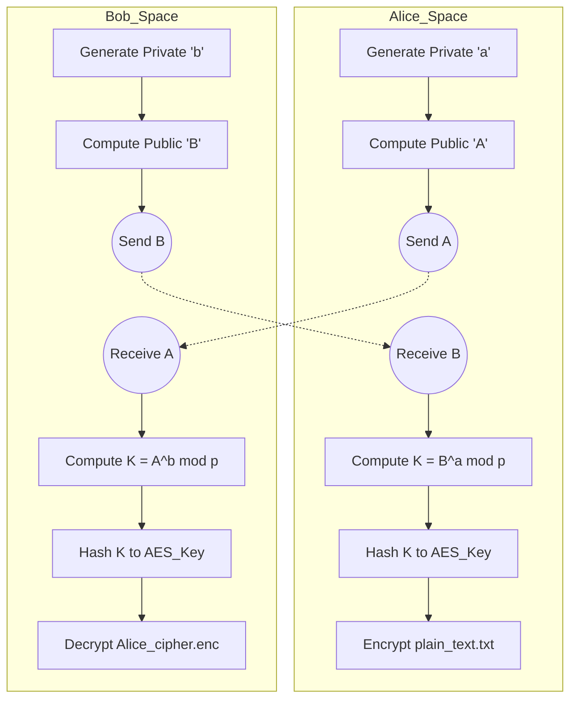
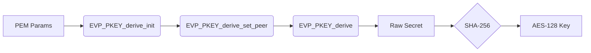
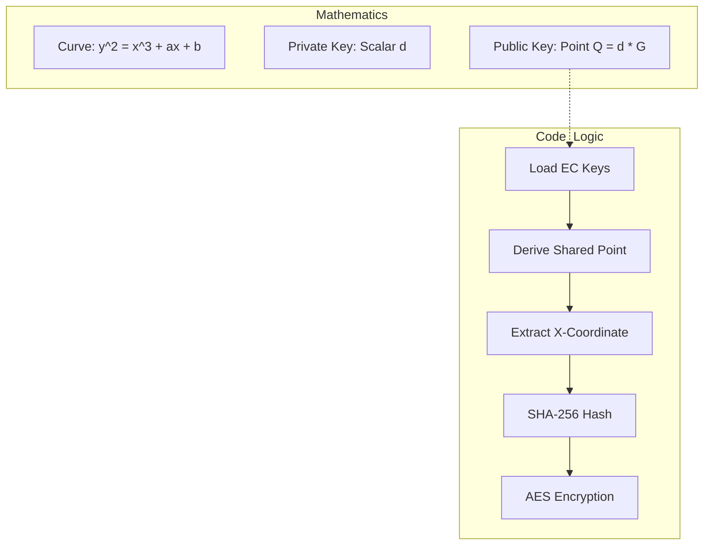
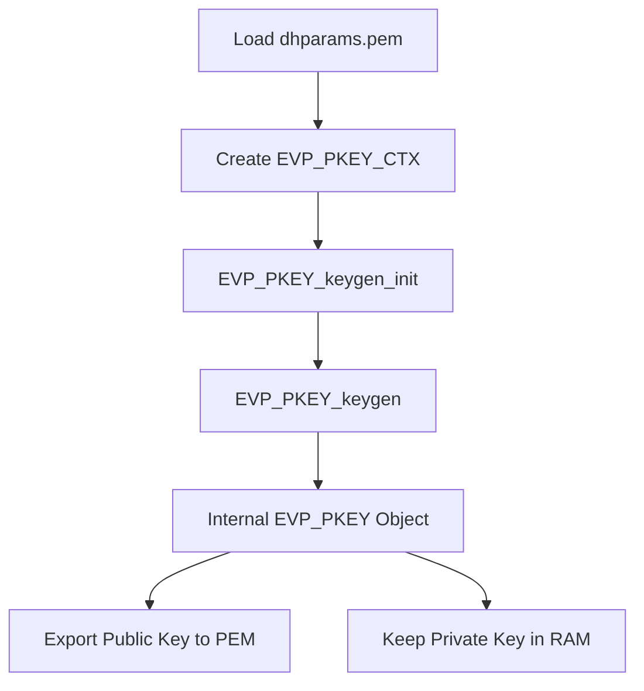
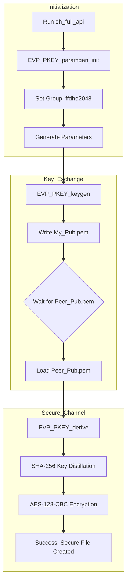
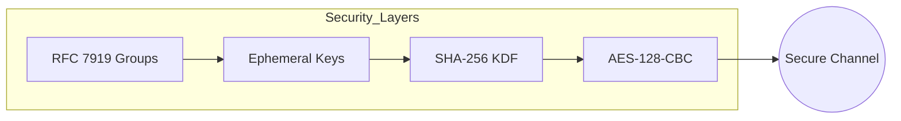

# Automated Diffie-Hellman Key Exchange: API Integration & Hybrid Cryptosystem

> **University Project | Foundations Of Cybersecurity Laboratory** 
> **| MSc Cybersecurity**
> A comprehensive exploration of cryptographic key agreement protocols, evolving from manual CLI parameter management to a fully automated C implementation using OpenSSL 3.x EVP APIs.

| Info | Details |
| :--- | :--- |
| **👤 Author** | **Giovanni Del Bianco** |
| **💻 Language** | **C** |
| **🛠️ Library** | **OpenSSL 3.0+** (EVP API) |
| **🧠 Key Concepts** | **DHKE**, **Elliptic Curve Cryptography (ECDH)**, **Key Derivation Functions (SHA-256)**, **Hybrid Encryption**, **Forward Secrecy**, **AES-128-CBC**. |
| **🎯 Goal** | Implement a secure end-to-end communication channel between two entities (Alice and Bob) by establishing a shared secret over an insecure medium. |


## 🚨 The Scenario: Establishing Trust in a Zero-Trust Environment

### 1. The Secure Key Exchange Problem
The fundamental challenge in cryptography is how two parties, who have never met, can establish a shared secret key without an eavesdropper (Eve) being able to intercept it. If they simply send a password in plain text, Eve sees it. 

The **Diffie-Hellman Key Exchange (DHKE)** protocol solves this by allowing Alice and Bob to exchange public information that, when combined with their respective private secrets, results in the same shared key.

### 2. The Laboratory Mission
This project documents the development of a secure communication suite. We don't just "encrypt a file"; we build the infrastructure required to:
*   **Generate Mathematical Parameters**: Defining the "rules" of the exchange ($p$ and $g$ or Elliptic Curves).
*   **Establish Identity**: Generating temporary (ephemeral) public/private key pairs.
*   **Derive a Shared Secret**: Using the DH/ECDH algorithm to arrive at a common value.
*   **Secure the Channel**: Transitioning from asymmetric "Key Agreement" to high-performance symmetric encryption (AES-128-CBC).

### 3. The Logic Flow (Alice & Bob)
The following diagram illustrates the high-level logic we implemented throughout the laboratory:



### 4. Evolutionary Roadmap
To reach full automation, the project was divided into 4 progressive steps, each adding a layer of complexity and professional refinement:
1.  **Classic DH**: Manual parameter generation via CLI, focusing on API-based secret derivation.
2.  **Elliptic Curves (ECDH)**: Transitioning to modern ECC standards (`prime256v1`) for better performance and security.
3.  **API Key Generation**: Moving key generation from the command line directly into the application memory.
4.  **Full API Automation**: A self-contained C application that handles parameters, keys, and encryption with zero external dependencies.


## 🏗️ Step 1: Classic Diffie-Hellman - The Foundation

### 1. Conceptual Analysis
In this initial phase, we focused on the core mechanics of the **Finite Field Diffie-Hellman** algorithm. The goal was to understand how to load external parameters and perform the secret derivation in C.
*   **Parameter Loading**: We used OpenSSL APIs to read the prime $p$ and generator $g$ from a PEM file generated via CLI.
*   **The Shared Secret**: We implemented the mathematical operation $K = B^a \pmod p$, where $a$ is Alice's private key and $B$ is Bob's public key.

### 2. Key Takeaways
*   **Complexity Management**: Handling large prime numbers (2048-bit) requires specialized abstraction layers like the `EVP_PKEY` interface.
*   **The Golden Rule**: We learned that the raw shared secret is not a cryptographically strong key. It must be "distilled" using an Hashing function (SHA-256) to ensure uniform entropy before being used in symmetric ciphers like AES.




## ⚡ Step 2: Elliptic Curves (ECDH) - Efficiency & Modernity

### 1. Why Elliptic Curves?
The laboratory evolved to replace the classic DH with **Elliptic Curve Diffie-Hellman (ECDH)**. While the goal remains the same (key agreement), the underlying mathematics change from modular exponentiation to point multiplication on a curve.
*   **Standard Curve**: We adopted the **`prime256v1`** (NIST P-256) curve.
*   **Performance**: ECC provides the same security level as classic DH but with significantly smaller keys (256-bit ECC $\approx$ 3072-bit DH), leading to faster computations and lower bandwidth usage.

### 2. Implementation Logic
The structure of the C code remained largely consistent thanks to the **EVP API** abstraction, but we shifted the initialization to handle curve NIDs (Numerical Identifiers).



### 3. What We Learned
*   **Algorithmic Agility**: By using the `EVP` interface, we successfully swapped the entire mathematical backend (from DH to ECDH) by changing only a few lines of configuration, demonstrating the power of modular code design.
*   **Security Strength**: Understanding that smaller keys in ECC do not mean less security, but rather more efficient mathematics.


## ⚙️ Step 3: API Key Generation - Moving to Memory

### 1. Conceptual Analysis
In Step 3, we transitioned away from generating public/private key pairs via the OpenSSL command line. Instead, we implemented the generation logic directly within the C application.
*   **Context Management**: We introduced `EVP_PKEY_CTX`, a dedicated context for key generation.
*   **Ephemeral Keys**: This approach allows for the creation of "ephemeral" keys—temporary keys generated for a single session—which is a core requirement for achieving **Forward Secrecy**[cite: 1].

### 2. Implementation Logic
The application loads the shared parameters ($p$ and $g$) and uses them as a template to "seed" the creation of a new, random private key and its corresponding public key in the system's RAM.




## 🤖 Step 4: Full API Automation - The Final Solution

### 1. The "Zero-Dependency" Goal
The final stage of the project represents the pinnacle of the laboratory: a fully automated, self-contained cryptosystem. In this version, even the mathematical parameters ($p$ and $g$) are generated (or selected from standardized groups) through API calls.

### 2. Advanced Features
*   **Standardized Groups**: We utilized the `ffdhe2048` group (Finite Field Diffie-Hellman Ephemeral) to ensure compliance with modern security standards (RFC 7919) without the slow overhead of searching for new primes.
*   **Integrated Workflow**: A single binary now handles:
    1.  Parameter Generation.
    2.  Ephemeral Key Generation.
    3.  Peer Public Key Exchange.
    4.  Secret Derivation & SHA-256 Hashing.
    5.  Full File Encryption/Decryption with AES-128-CBC.

### 3. Final Architecture
This diagram represents the complete, automated lifecycle of the finalized application:




## 🧠 Key Learnings & Competencies

By completing this evolutionary journey, I have developed a deep expertise in:
*   **OpenSSL 3.x EVP Framework**: Moving away from legacy functions to use the modern, provider-based architecture of OpenSSL.
*   **Cryptographic Memory Management**: Ensuring sensitive data (private keys and raw secrets) are correctly allocated and wiped from memory using `OPENSSL_free` and appropriate context cleanups.
*   **Hybrid Encryption Logic**: Mastering the bridge between asymmetric key agreement and symmetric data encryption.
*   **Interoperability**: Designing software that can exchange complex cryptographic objects (PEM files) between different running instances.


## 🔬 4. Technical Deep Dive: Under the Hood

### 4.1. EVP_PKEY vs Legacy API: Future-Proofing
In this project, I deliberately avoided legacy OpenSSL functions (like `DH_new` or `ECDH_compute_key`) in favor of the **EVP_PKEY** interface.
*   **Abstraction Layer**: The EVP API allows the same code to handle both classic DH and Elliptic Curves by simply changing the algorithm ID.
*   **Provider Support**: OpenSSL 3.x uses a provider-based architecture; `EVP` is the standard way to ensure compatibility with modern hardware security modules (HSMs) and future library updates.

### 4.2. The "Golden Rule" of Key Derivation
A common pitfall in DHKE is using the raw shared secret as an encryption key.
*   **The Problem**: The raw secret $g^{ab} \pmod p$ (or the x-coordinate of an EC point) may have non-uniform entropy and mathematical structure that could be exploited.
*   **The Solution**: I implemented a **Key Derivation Function (KDF)** using **SHA-256**. By hashing the raw secret, we "distill" the entropy into a fixed-length, uniform 256-bit key, which is then truncated or used for **AES-128-CBC**.

### 4.3. Hybrid Encryption & Padding Logic
To encrypt files of arbitrary size, we implemented a hybrid system.
*   **AES-128-CBC**: Chosen for its balance between performance and security.
*   **PKCS7 Padding**: Since AES is a block cipher (16-byte blocks), the code uses `EVP_CipherFinal_ex` to automatically handle padding, ensuring that files not perfectly multiple of 16 bytes are encrypted without data loss.


## 🚀 5. Results & Interleaved Verification

### 5.1. Alice & Bob Interaction (Step 4)
The following trace demonstrates how the two instances (Alice and Bob) interact through the filesystem to simulate a network exchange:

```text
[Alice] DH Parameters (2048 bit) generated via API.
[Alice] DH Key pair generated successfully.
[Alice] Public key written to Alice_pub.pem. Exchange it and press ENTER.

[Alice] Shared secret derived. Key distilled via SHA-256.
[Alice] Local file encrypted into Alice_cipher.enc.

[Alice] Decrypting peer message (Bob)...
[Alice] Decrypted text: "Hello Alice, this is Bob. The secret is established!"
```

### 5.2. Cross-Decryption Success
The ultimate proof of the project's success is the mathematical coincidence of the keys.
*   **Verification**: Alice's calculated key matches Bob's calculated key byte-for-byte.
*   **Integrity**: The decrypted output matches the original `samples/plain_text.txt` exactly, proving that the IV (Initialization Vector) and padding were handled correctly across the two independent processes.


## 🎓 6. Key Takeaways & Security Insights

### 6.1. Modern Memory Management in C
Working with OpenSSL requires rigorous resource handling.
*   **Contextual Lifecycle**: Every `EVP_PKEY_CTX` must be explicitly freed to avoid memory leaks.
*   **Secure Cleanup**: I learned to use `OPENSSL_free` for sensitive buffers like the shared secret to ensure they are properly handled by the OpenSSL secure heap if enabled.

### 6.2. Compliance with RFC 7919
In the final Step 4, we didn't just generate "any" prime number.
*   **Safe Primes**: We used the `ffdhe2048` group name.
*   **Anti-Logjam**: Standardized groups are resistant to pre-computation attacks like Logjam, as they provide a "safe prime" where $(p-1)/2$ is also prime, significantly increasing the difficulty for an attacker to solve the discrete logarithm problem.




## 🛠️ 7. How to Reproduce

This project is designed to be easily compiled and tested on any Linux-based system. Follow the steps below to explore the laboratory evolution.

### 7.1. Prerequisites
Ensure you have the OpenSSL development libraries and standard build tools installed:

```bash
# For Debian/Ubuntu based systems
sudo apt update
sudo apt install build-essential libssl-dev
```

### 7.2. Building the Project
The project uses a centralized **Makefile** to manage the compilation of all four stages.

```bash
# Clone the repository
git clone https://github.com/Giovanni-Del-Bianco/OpenSSL-DHKE-Evolution.git
cd OpenSSL-DHKE-Evolution

# Compile all steps (binaries will be placed in the /bin folder)
make all
```


### 7.3. Step-by-Step Evolution Guide

Before starting, ensure all binaries are compiled by running `make all` in your root directory.

#### 🟢 Phase 1: Classic DH (Steps 1 & 3)
These steps require external mathematical parameters. We must generate a 2048-bit prime group first.

1.  **Generate Parameters**:
    ```bash
    ./scripts/gen_dh_params.sh
    ```
2.  **Execution (Step 1 - Manual Derivation)**:
    Open two terminals to simulate Alice and Bob:
    *   **Alice**: `./bin/dh_manual dhparams.pem alice_priv.pem alice_pub.pem bob_pub.pem`
    *   **Bob**: `./bin/dh_manual dhparams.pem bob_priv.pem bob_pub.pem alice_pub.pem`
3.  **Execution (Step 3 - API Keygen)**:
    *   **Alice**: `./bin/dh_api_keygen dhparams.pem Alice`
    *   **Bob**: `./bin/dh_api_keygen dhparams.pem Bob`


#### 🟡 Phase 2: Elliptic Curve DH (Step 2)
This version uses the `prime256v1` curve. It is faster and doesn't require the `dhparams.pem` file.

*   **Alice**: `./bin/ecdh_lab alice_priv.pem bob_pub.pem`
*   **Bob**: `./bin/ecdh_lab bob_priv.pem alice_pub.pem`


#### 🔴 Phase 3: The Final Solution (Step 4)
This is the fully automated version. Parameters and keys are generated internally. It includes the complete AES-128-CBC file encryption workflow.

**Interleaved Synchronization Logic:**
To succeed, you must coordinate the two terminals following the "handshake" logic:

| Action | Terminal Alice | Terminal Bob |
| :--- | :--- | :--- |
| **1. Start** | `./bin/dh_full Alice Bob` | `./bin/dh_full Bob Alice` |
| **2. Key Exchange** | Wait for `Alice_pub.pem` | Wait for `Bob_pub.pem` |
| **3. Derive Secret** | Press **ENTER** | Press **ENTER** |
| **4. Verify** | Alice decrypts Bob's file | Bob decrypts Alice's file |


### 🧪 7.4. Automated Verification Script
If you want to quickly verify the final step (Step 4) without manual input, use the provided test script:
```bash
chmod +x scripts/*.sh
./scripts/run_test_interleaved.sh
```


### 🧹 7.5. Environment Cleanup
To maintain a clean workspace and remove all compiled binaries, temporary PEM keys, and encrypted test files, simply run:
```bash
make clean
```


### 💡 Execution Note: The "Exchange" Logic
Since we are simulating a network on a local machine, "exchanging keys" means Alice waits for Bob to write his `.pem` file to the disk before she tries to read it. Always wait for both programs to reach the **"Press ENTER"** prompt before proceeding in either terminal.


## 📜 License
This project is released under the MIT License.

